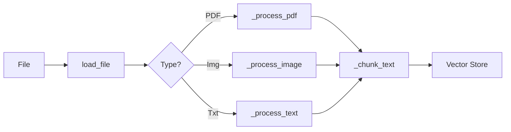

# ingester.py

> Contains a `Ingestor` Class which is basically the entire "ingestion pipeline" which has the following functions 

### init 
this is the constructor \

### _ensure_map_files
this function creates an data folder if its not there and creates an empty json map.\

### _update_map
this function checks the filename for patterns of module or chapter.etc to find names \
this uses `re` library\
if the filename gives nothing it checks the first 2k char of the content \
tries searching for titles in inital lines\
this helps when u ask the model to summarise an entire chapter etc.\

### _update_status
this function sends signal to status mangaer which updates the status bar in the ui\

### load_file
checks fil extension and sends to proper function\

### _process_pdf
uses `pypdf` to extract text\

### _process_image
uses  `pytesseract` to extract text from img\

### _process_text
reads text

### _chunk_text
this slices the text based on a certain size and overlap\
this is important so that u only send relevant chunks to the llm when u are asked for them\
these chunks will also be used by the embeding model later\

### process_and_embed
this is the main function which uses the other functions and does the actual processing in this pipeline\
it calls load file loads the file checks for text once text is found its passed to a vectorstore funtion to embed and store the data chunks
update status is sent after each step\

### sync_existing_files
checks list of notes\
lists all notes in db\
if notes not in db calls `process_and_embed`\

---

# vector_store.py

### __init__
specifies paths and names\
specifies the embedding model\
specifies the variable used by other functions which basically changes text to numbers using the embedding function 

### add_documents
adds the list of text chunks(documents) and info about each chunk (a list of dict or metadata) and ids

### get_all_files
gets the metadata of all chunks used to figure out what exists in the db as of now 

---

# watcher.py

### on_created/on_modified
using the `watchdog` libraries event handler keeps a watch for changes

### process
this function is the most important as this is the one which calls the ingestor to process files 

## Filewatcher Class
its mainly a wrapper around `watchdog` library/
it contains a start and a stop function which checks if the dir exists and asks `NotesHandler` to watch that dir/
this class also creates its own instance of `Ingestor`
